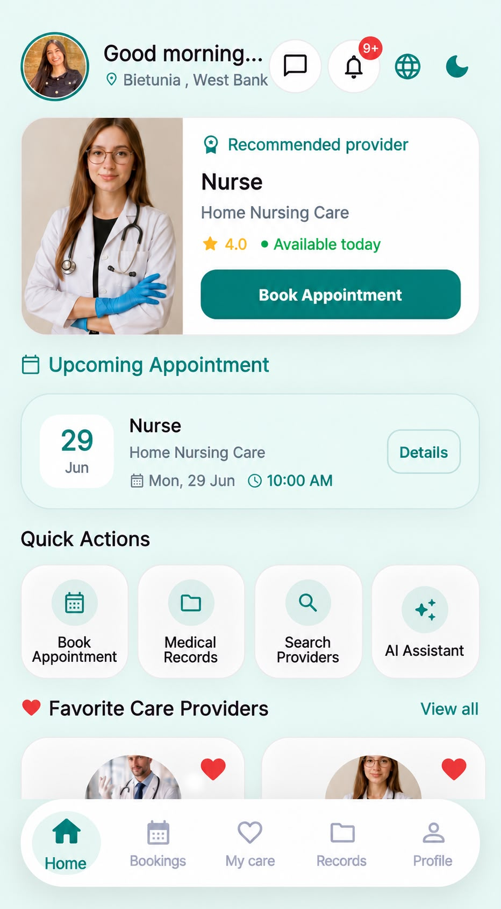
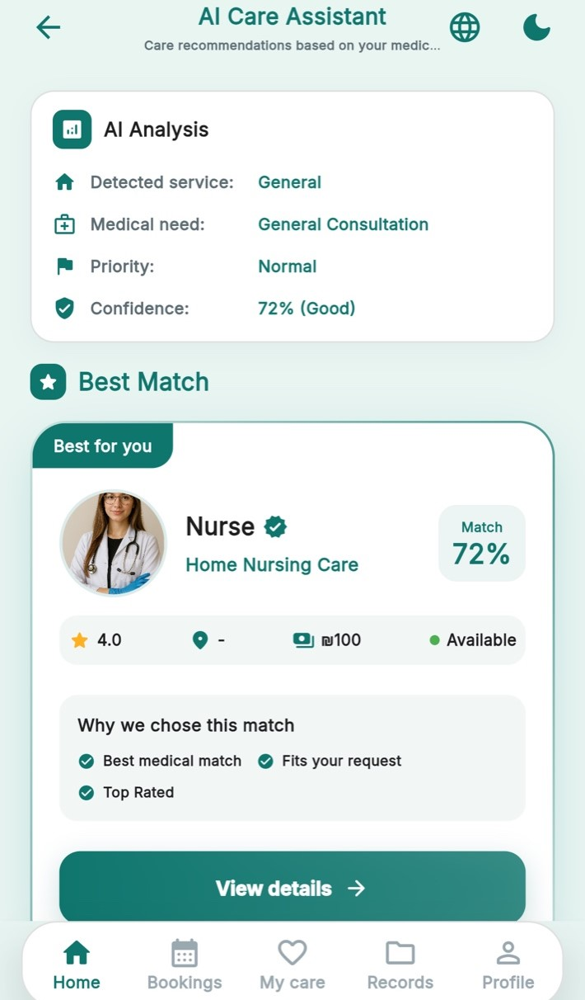
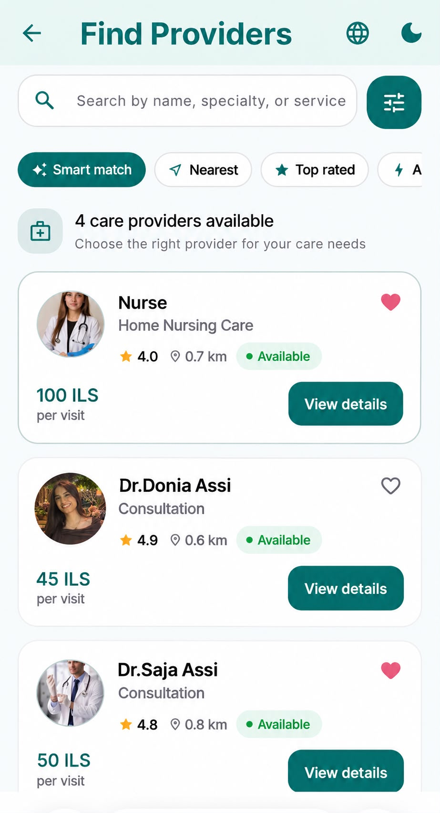
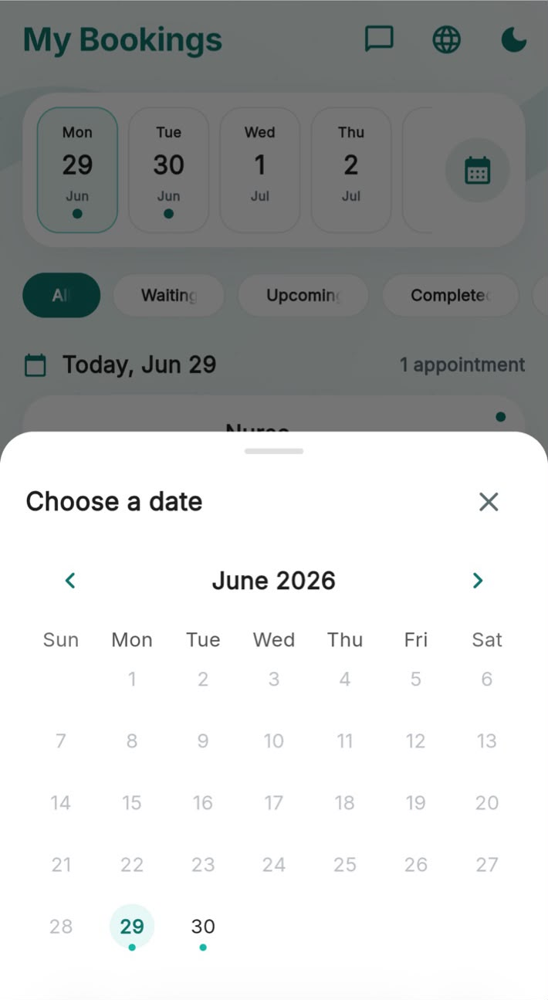
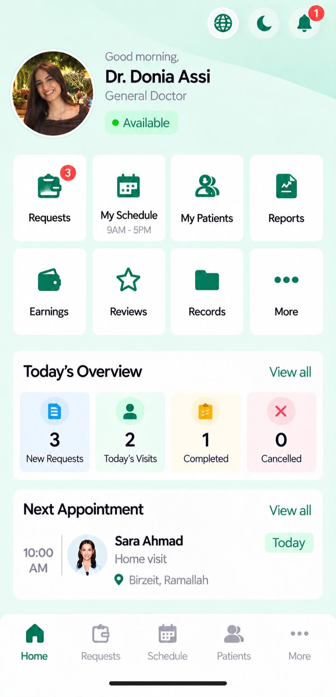
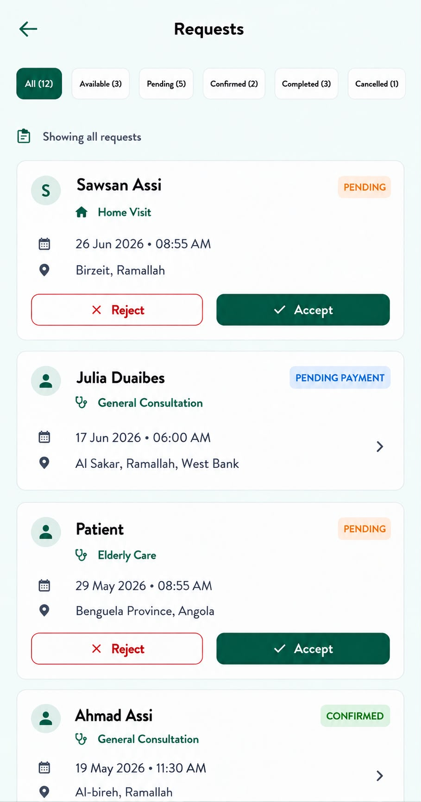
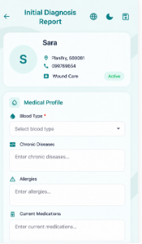
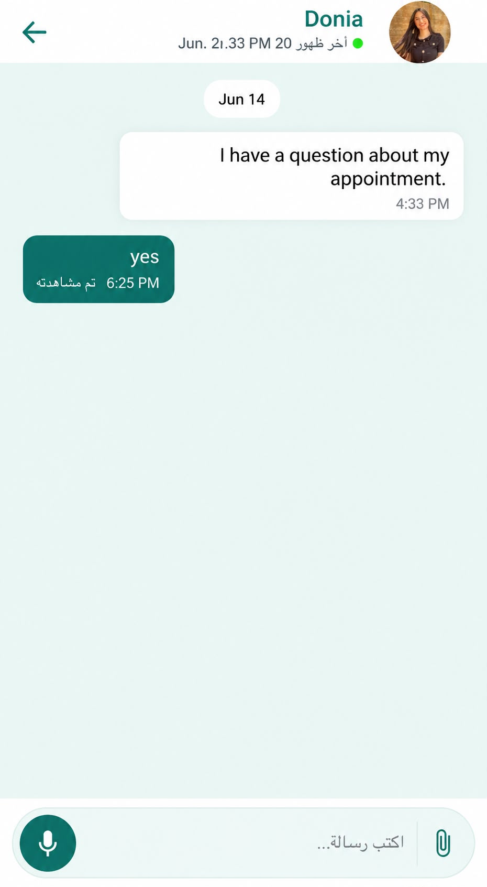
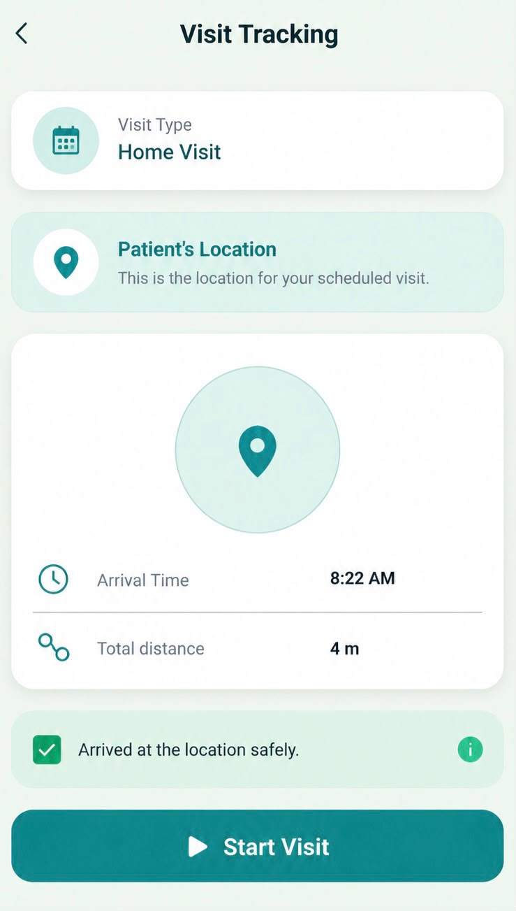
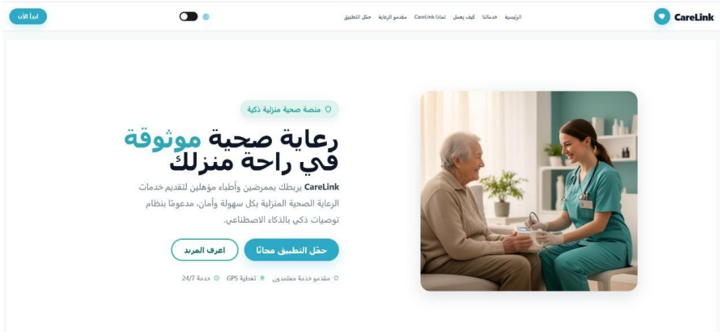

# CareLink

### Intelligent Home Healthcare Services Platform

CareLink is an integrated home healthcare platform designed to connect patients with qualified doctors and nurses for reliable home healthcare services.

The platform digitally streamlines the complete home healthcare journey, from finding suitable healthcare providers and requesting services to appointment management, secure payments, medical record management, communication, visit tracking, medical reports, and service evaluation.

CareLink combines a Flutter mobile application, a Node.js/Express.js backend, a MySQL database, an AI-powered healthcare provider recommendation system, and a dedicated marketing website.

---

## Project Overview

| Category | Details |
|---|---|
| **Platform** | Home Healthcare Services Platform |
| **Mobile Application** | Flutter, Dart |
| **Backend** | Node.js, Express.js |
| **Database** | MySQL |
| **API** | REST API |
| **AI Recommendation** | AI-powered healthcare provider recommendation |
| **User Roles** | Patient, Doctor, Nurse, Admin |
| **Project Type** | Graduation Project |

---

## About

CareLink was developed to digitally improve the accessibility, organization, and efficiency of home healthcare services.

Patients can create accounts, manage their personal and medical information, request home healthcare services, find suitable doctors and nurses, schedule appointments, communicate with healthcare providers, make payments, access medical records, and rate completed services.

Healthcare providers can manage service requests, appointments, availability, patient information, medical reports, visits, and earnings.

Administrators can manage users, verify healthcare providers, manage service pricing, monitor bookings and payments, manage payouts, and access platform statistics.

The system also includes an AI-based recommendation component that helps patients find suitable healthcare providers based on their healthcare needs, medical information, location, availability, specialization, ratings, and experience.

---

## Key Features

### 👤 Patient

- Patient registration and account management
- Personal profile management
- Medical information and healthcare history
- Home healthcare service requests
- Search doctors and nurses
- AI-powered provider recommendations
- Location-based provider matching
- Appointment scheduling
- Booking and request status tracking
- Appointment cancellation and rescheduling
- Secure online payments
- Payment holding and platform commission management
- Medical records access
- In-app messaging
- Real-time notifications
- Provider ratings and feedback
- Favorite healthcare providers
- GPS-based address management
- Arabic and English language support
- Light and dark mode support

### 👨‍⚕️ Doctor

- Doctor registration and email verification
- Professional document and certificate upload
- Administrator verification
- Doctor profile management
- Availability management
- Service request management
- Appointment and schedule management
- Patient information and medical profile
- Initial diagnosis reports
- Treatment plans
- Required visit management
- Visit reports
- Medical record management
- Doctor-patient communication
- Notifications
- Earnings and payment management

### 👩‍⚕️ Nurse

- Nurse registration and email verification
- Professional document upload
- CV, nursing license, medical certificates, and ID management
- Administrator approval
- Nurse profile management
- GPS location management
- Availability management
- Home-care availability settings
- Nearby service requests
- AI-recommended service requests
- Accepting and rejecting requests
- Visit management
- Visit tracking
- Electronic nursing visit reports
- Patient medical information
- Patient communication
- Earnings management
- Payout requests
- Notifications
- Arabic and English language support

### 🛡️ Admin

- User management
- Doctor and nurse management
- Healthcare provider verification
- Professional document verification
- Service request management
- Booking management
- Service pricing management
- Provider rate assignment
- Payment and transaction monitoring
- Platform commission management
- Provider earnings monitoring
- Payout management
- Service ratings management
- Platform statistics and analytics
- Administrative dashboard

---

## AI Recommendation System

CareLink includes an AI-powered healthcare provider recommendation system that helps patients discover suitable doctors and nurses.

The recommendation system analyzes available patient and provider information to generate ranked healthcare provider recommendations.

### Recommendation Factors

| Factor | Description |
|---|---|
| **Symptoms** | Patient health symptoms used for provider matching |
| **Medical Information** | Patient medical information and records |
| **Service Type** | Required home healthcare service |
| **Specialization** | Provider specialization relevant to patient needs |
| **Location** | Patient and provider geographic location |
| **Availability** | Provider schedule and appointment availability |
| **Ratings** | Patient ratings and feedback |
| **Experience** | Provider professional experience |

As additional healthcare information becomes available, including diagnoses and visit reports, the recommendation results can be improved to better reflect patient needs.

---

## Healthcare Services

CareLink supports different types of home healthcare services, including:

- Post-operative care
- Physiotherapy
- Medication administration
- Elderly care
- Pediatric home nursing
- Other home healthcare services

---

## Payment System

CareLink provides an integrated payment workflow for healthcare services.

The system supports:

- Service cost calculation
- Platform commission calculation
- Payment processing
- Payment holding mechanism
- Transaction records
- Provider earnings
- Provider payout requests

The platform manages the payment workflow and commission, while healthcare provider earnings are calculated based on completed services.

---

## Medical Records

CareLink provides structured medical information management.

The system supports:

- Patient medical information
- Healthcare history
- Initial diagnosis reports
- Treatment plans
- Required visits
- Electronic visit reports
- Medical documentation
- Provider medical records

---

## Communication

CareLink provides in-app communication between patients and healthcare providers.

Features include:

- Patient-provider chat
- Text messaging
- Attachments
- Conversation history
- Notifications for new messages

---

## Location Services

CareLink uses GPS and mapping technologies to support location-based healthcare services.

Location features include:

- Current device location
- Address detection
- Reverse geocoding
- Provider proximity
- Location-based provider recommendations
- Map visualization

---

## Notifications

The platform provides notifications for important healthcare events, including:

- Booking updates
- Service request updates
- Provider approvals
- Appointment updates
- Cancellations
- New messages
- Other system events

---

## Marketing Website

CareLink also includes a dedicated marketing website designed to introduce the platform and its healthcare services.

The website provides:

- CareLink introduction
- Healthcare services
- How CareLink works
- Platform advantages
- Healthcare provider information
- Mobile application download section
- QR code for accessing the mobile application

---

## Technologies Used

### Frontend

- Flutter
- Dart
- Material UI
- Responsive mobile interfaces

### Backend

- Node.js
- Express.js
- RESTful APIs
- JWT Authentication

### Database

- MySQL
- MySQL2

### AI

- AI-powered provider recommendation
- Provider ranking and matching

### Authentication & Security

- JWT Authentication
- bcrypt password hashing
- Email verification
- Role-Based Access Control
- Google Authentication
- Facebook Authentication
- Apple Authentication

### Location & Maps

- Geolocator
- Geocoding
- Flutter Map
- Latlong2
- OpenStreetMap
- Nominatim

### Communication & Services

- REST APIs
- Real-time notifications
- In-app messaging
- SMTP email services

### File Management

- Image Picker
- File Picker
- Multer
- PDF processing
- Medical and professional document management

### Development Tools

- Visual Studio Code
- Android Studio
- Git
- GitHub
- npm
- MySQL Workbench

---

## System Architecture

CareLink follows a multi-component architecture connecting the Flutter mobile application with the Node.js backend, MySQL database, AI recommendation system, and external services.

```text
                    ┌──────────────────────┐
                    │     CareLink App     │
                    │     Flutter / Dart   │
                    └──────────┬───────────┘
                               │
                               │ REST APIs
                               │
                    ┌──────────▼───────────┐
                    │     Node.js /        │
                    │     Express.js       │
                    │       Backend        │
                    └──────────┬───────────┘
                               │
              ┌────────────────┼────────────────┐
              │                │                │
              ▼                ▼                ▼
        ┌──────────┐    ┌──────────────┐   ┌─────────────┐
        │  MySQL   │    │      AI      │   │  External   │
        │ Database │    │Recommendation│   │  Services   │
        └──────────┘    └──────────────┘   └─────────────┘
        CareLink implements security mechanisms to protect user accounts and system resources.

JWT Authentication
Password hashing using bcrypt
Role-Based Access Control
Email verification
Secure REST API access
Protected medical information
Installation
Clone the Repository
git clone https://github.com/DoniaAssi/carelink.git
cd carelink
Backend
cd backend
npm install
npm start
Flutter
flutter pub get
flutter run
## Screenshots

### 🏠 Patient Home

Patient dashboard showing upcoming appointments, quick actions, and healthcare services.


🤖 AI Recommendation

AI-powered provider recommendation based on patient healthcare needs.


🔍 Find Healthcare Providers

Patients can search and explore available doctors and nurses.


📅 Appointment Booking

Complete booking workflow including date and time selection for healthcare services.


📖 My Bookings

Patients can view and manage their upcoming and previous appointments.


💬 Messaging

Patients and healthcare providers can communicate through the in-app messaging system.


👨‍⚕️ Doctor Module

Doctors can manage service requests, medical reports, patient communication, and home visits.

    
🌐 Marketing Website

CareLink marketing website introducing the platform and providing access to the mobile application.


Testing

CareLink was tested across the main system modules.

Testing included:

Patient
Home healthcare service booking
Booking validation
Payment workflow
Doctor
Service request management
Initial diagnosis reports
Visit reports
Medical record management
Duplicate diagnosis prevention
Nurse
Home healthcare visit workflow
Availability management
Visit tracking
Visit reports
Payout requests
Admin
Healthcare provider approval
Provider verification
Service pricing management
Booking and payment management
Project Status

🟢 Graduation Project Completed

Version: 1.0

Future Improvements

Potential future improvements include:

Video consultations
Push notifications
AI chatbot
Electronic prescriptions
Wearable device integration
Further improvements to AI provider recommendations
Team
Team Member	Role
Donia Assi	CareLink Team
Sara Ahmad	CareLink Team
Julia Duaibes	CareLink Team
Supervisor

Dr. Ahmed Abusnaina

Academic Project

Project: CareLink

Area: Home Healthcare & Digital Health

Project Type: Graduation Project

Year: 2026

Acknowledgements

The CareLink team would like to thank Birzeit University and our project supervisor, Dr. Ahmed Abusnaina, for their guidance, support, and academic supervision throughout the development of this graduation project.

Developed by the CareLink Team

Donia Assi • Sara Ahmad •Julia Duaibes 

Birzeit University • 2026